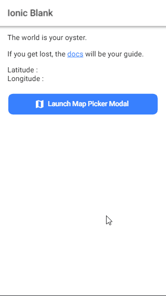

# Ionic 4 + Angular 7 Maps Picker Modal

Change apiKey gmaps: src\app\component\map-picker\map-picker.component.ts

maps library use: @agm/core https://www.npmjs.com/package/@agm/core

## Enable library Google service API
- Maps JavaScript API
- Places API
- Geocoding API

## Getting Started
* Clone this repository: git clone https://github.com/qhoirulanwar/ionic4-map-picker.git.
* Run npm install from the project root.
* Run ionic serve in a terminal from the project root.

## App Preview

